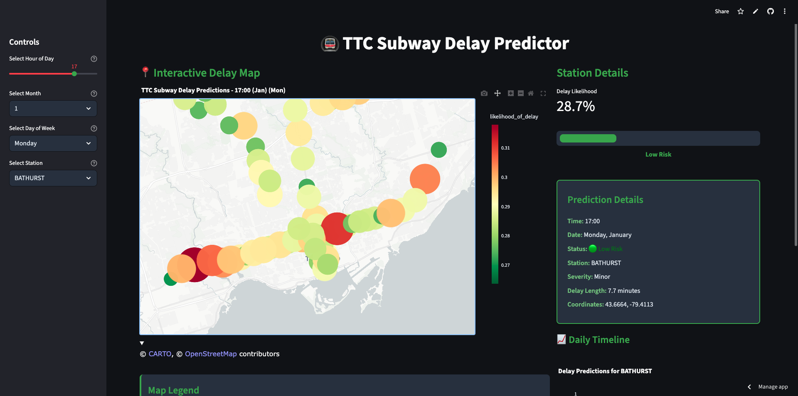
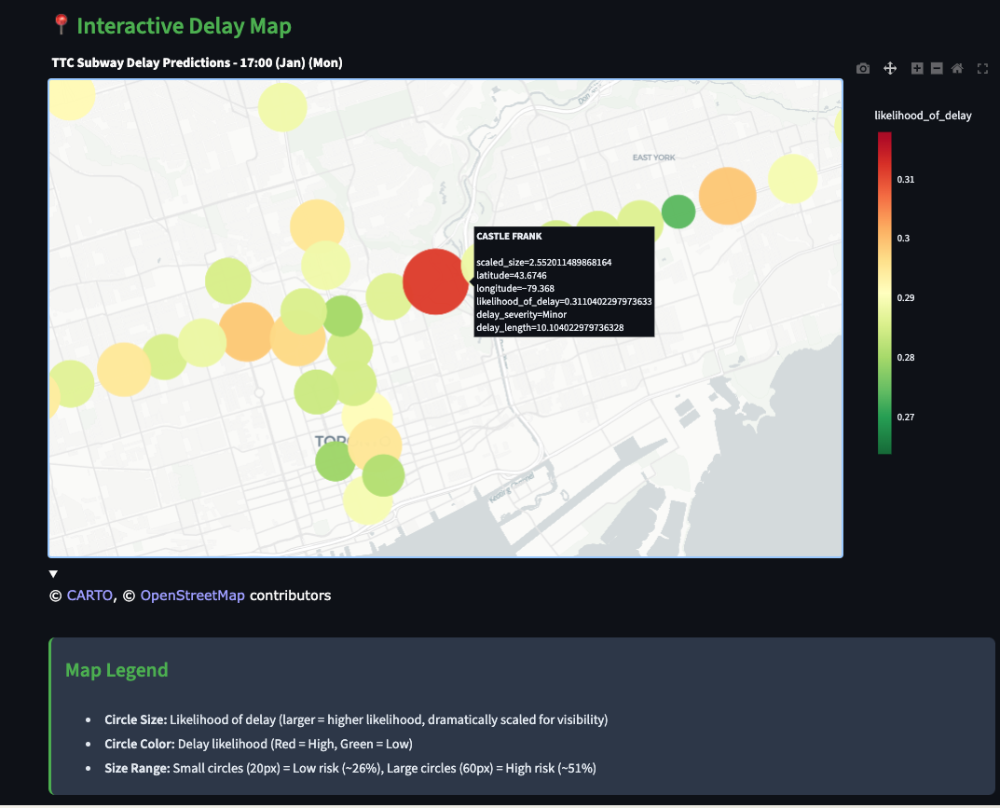
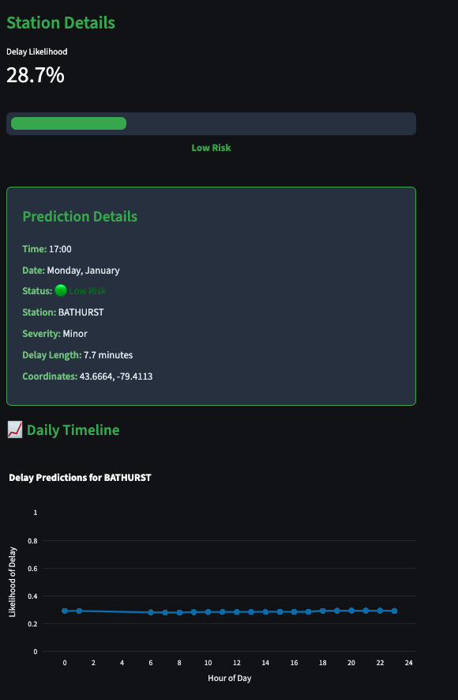
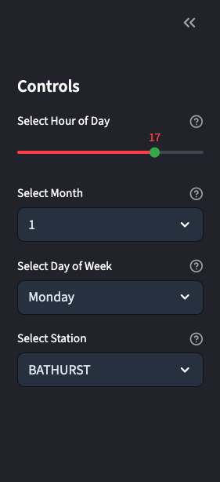

# TTC Subway Delay Predictor

A comprehensive machine learning application for predicting TTC subway delays using neural networks and interactive visualizations.

## Overview

This project was initially created for the 2025 SDSS Datathon and has been enhanced with a complete Streamlit frontend, comprehensive data processing, and more advanced analytics. The application provides real-time delay predictions for all TTC subway stations with interactive maps, temporal analysis, and risk assessment tools.

## Features

- **Interactive Map Visualization**: Real-time delay predictions displayed on an interactive map
- **Station-Specific Analysis**: Detailed predictions for individual stations
- **Time-based Filtering**: View predictions for any hour, month, and day of the week
- **Risk Assessment**: Color-coded risk levels (Low, Moderate, High) with visual progress bars
- **Daily Timeline Charts**: Track delay patterns throughout the day
- **Statistical Insights**: Overall system performance and peak hour analysis
- **Dark Mode UI**: Modern, accessible interface optimized for all users

## Demo

### Main Application Interface

*Interactive map showing delay predictions across TTC subway stations with sidebar controls and station details panel*

### Interactive Map Visualization

*Close-up view of the map showing stations with color-coded risk levels and hover information*

### Risk Assessment Dashboard

*Detailed station prediction display with color-coded progress bar, risk indicators, and daily timeline chart*

### User Controls and Filtering

*Sidebar controls for time selection, month/day filtering, and station selection with real-time updates*

## Quick Setup

### Prerequisites
- Python 3.8+
- Git

### 1. Clone and Setup
```bash
git clone <your-repo-url>
cd SDSS-Datathon-2025-extended
```

### 2. Create Virtual Environment
```bash
python -m venv .venv
source .venv/bin/activate  # On Windows: .venv\Scripts\activate
```

### 3. Install Dependencies
```bash
pip install -r requirements.txt
```

### 4. Run the Application
```bash
streamlit run app.py
```

### 5. Open Your Browser
Navigate to the URL shown in the terminal (typically `http://localhost:8501`)

## Data Sources

The application uses pre-computed predictions from a neural network model trained on historical TTC data:

- **Enriched Predictions**: `src/routes/resources/enriched_predictions_full.csv` (277,200 records)
- **Station Data**: `src/routes/resources/station_data.json`
- **Coverage**: 63 unique stations across all TTC subway lines

### Data Processing Results
- **Total Records**: 277,200
- **Unique Stations**: 63
- **Hour Range**: 0-23 (24-hour coverage)
- **Average Likelihood**: 29.5%
- **Likelihood Range**: 26.4% - 50.8%

### Top 5 Highest Risk Stations
1. **SPADINA**: 35.0% average likelihood
2. **QUEEN**: 34.3% average likelihood
3. **DUPONT**: 34.1% average likelihood
4. **SUMMERHILL**: 33.9% average likelihood
5. **YORK MILLS**: 32.1% average likelihood

## How to Use

### Main Interface
1. **Time Selection**: Use the sidebar slider to select the hour of day (0-23)
2. **Month Selection**: Choose a specific month from the dropdown
3. **Day Selection**: Select the day of the week
4. **Station Selection**: Choose a specific station from the dropdown menu
5. **Map Interaction**: Hover over stations on the map to see detailed information

### Understanding the Visualizations

#### Interactive Map
- **Circle Size**: Represents likelihood of delay (larger = higher likelihood)
- **Circle Color**: Color-coded risk levels (Red = High, Green = Low)
- **Hover Information**: Detailed station information and delay predictions
- **Temporal Filtering**: Map updates based on selected time parameters

#### Station Timeline
- **Line Chart**: Shows delay likelihood throughout the day for selected station
- **Peak Hours**: Easily identify high-risk time periods
- **Pattern Analysis**: Understand daily delay patterns

#### Risk Assessment
- **Progress Bar**: Visual representation of delay likelihood
- **Color Coding**: Green (Low), Orange (Moderate), Red (High)
- **Detailed Metrics**: Severity, delay length, and coordinates

## Technical Architecture

### Core Components
- **Frontend**: Streamlit web framework
- **Visualization**: Plotly for interactive charts and maps
- **Data Processing**: Pandas for data manipulation
- **Machine Learning**: PyTorch-based neural network
- **Caching**: Streamlit's built-in caching for performance

### Key Functions
- `load_data()`: Data loading and caching function
- `create_delay_map()`: Interactive map generation
- `create_delay_timeline()`: Timeline chart generation
- `get_delay_prediction()`: Individual prediction retrieval

### Performance Features
- **Data Caching**: Automatic caching of loaded data for faster subsequent loads
- **Responsive Design**: Adapts to different screen sizes
- **Real-time Updates**: Instant updates when changing parameters

## Machine Learning Model

### Neural Network Architecture
The delay predictions are generated using a neural network model with comprehensive features:

#### Input Features
- **Temporal Features**: Time of day, day of week, month, seasonal patterns
- **Station Features**: Station-specific characteristics and historical patterns
- **Operational Features**: Rush hour indicators, weekend patterns, holiday seasons

#### Output Predictions
- **Delay Likelihood**: Probability of experiencing a delay (0-1)
- **Risk Classification**: Low, Moderate, or High risk categories
- **Severity Assessment**: Minimal, Minor, Moderate, or Severe delays

### Likelihood Calculation Algorithm
```python
def create_likelihood_from_severity_and_length(severity, length):
    severity_scores = {
        'Minimal': 0.1,
        'Minor': 0.3,
        'Moderate': 0.6,
        'Severe': 0.9
    }
    
    base_score = severity_scores.get(severity, 0.3)
    length_factor = min(length / 30.0, 1.0)
    likelihood = base_score * 0.7 + length_factor * 0.3
    
    return min(likelihood, 1.0)
```

## Deployment Options

### Live Demo
**Try the app online**: [https://xiaotong-shen-sdss-datathon-2025-extended-app-zcrsie.streamlit.app/](https://xiaotong-shen-sdss-datathon-2025-extended-app-zcrsie.streamlit.app/)

### Local Development
```bash
streamlit run app.py
```

### Production Deployment
```bash
streamlit run app.py --server.port 8501 --server.address 0.0.0.0
```

### Cloud Deployment

#### Streamlit Cloud (Recommended)
1. Push to GitHub
2. Connect to [share.streamlit.io](https://share.streamlit.io)
3. Deploy with one click

#### Docker Deployment
```dockerfile
FROM python:3.9-slim
WORKDIR /app
COPY requirements.txt .
RUN pip install -r requirements.txt
COPY . .
EXPOSE 8501
CMD ["streamlit", "run", "app.py", "--server.port=8501", "--server.address=0.0.0.0"]
```

## Customization

### Styling
The application uses custom CSS for enhanced visual appeal:
- Modern dark theme with TTC branding
- Responsive design elements
- Custom metric cards and prediction boxes
- Color-coded risk indicators

### Adding New Features
To extend the application:
1. Add new visualization functions
2. Update the main interface in `app.py`
3. Include additional data sources as needed

## Project Structure

```
SDSS-Datathon-2025-extended/
├── app.py                                    # Main Streamlit application
├── requirements.txt                           # All Python dependencies
├── python notebooks/                         # Jupyter notebooks and ML models
│   ├── neuralnet.py                         # Neural network implementation
│   ├── exploratory-data-analysis/           # Data analysis notebooks
│   └── Transportation-Data/                 # Raw TTC data files
├── src/routes/resources/                    # Processed data files
│   ├── enriched_predictions_full.csv        # Complete predictions dataset
│   ├── station_data.json                    # Station information
│   └── join_prediction_data.py              # Data processing script
└── logs/                                    # Application logs
```

## Future Enhancements

### Planned Features
1. **Real-time Data**: Live TTC API integration
2. **Weather Correlation**: Weather data integration for better predictions
3. **Historical Trends**: Time-series analysis and pattern recognition
4. **Route Planning**: Multi-station journey analysis
5. **Mobile Optimization**: Enhanced responsive design

### Data Expansion
1. **Additional Lines**: Include bus and streetcar data
2. **Event Correlation**: Special events impact analysis
3. **Seasonal Patterns**: Weather and seasonal effects
4. **Demographic Data**: Population density correlation

## Troubleshooting

### Common Issues

1. **Data Loading Errors**:
   - Ensure data files exist in the correct paths
   - Check file permissions
   - Verify CSV format compatibility

2. **Map Not Displaying**:
   - Check internet connection (required for map tiles)
   - Verify Plotly installation
   - Clear browser cache if needed

3. **Performance Issues**:
   - Use virtual environment for isolated dependencies
   - Ensure sufficient system memory
   - Consider data caching for large datasets

4. **Import Errors**:
   - Activate virtual environment: `source .venv/bin/activate`
   - Install requirements: `pip install -r requirements.txt`
   - Check Python version (3.8+ required)

### Getting Help
- Check the console output for error messages
- Verify all dependencies are installed correctly
- Ensure Python version compatibility (3.8+ recommended)

## Development History

### Original Project
- **SDSS Datathon 2025**: Initial machine learning model development
- **Neural Network**: PyTorch-based delay prediction model
- **Data Analysis**: Comprehensive TTC data exploration

### Enhancements Added
- **Streamlit Frontend**: Complete web application interface
- **Data Processing**: Enhanced temporal and geographic features
- **Interactive Visualizations**: Maps, charts, and analytics dashboard
- **User Experience**: Intuitive controls and responsive design

## Contributing

1. Fork the repository
2. Create a feature branch
3. Make your changes
4. Test thoroughly
5. Submit a pull request

## Support

For questions or issues:
- Check the troubleshooting section above
- Review the neural network implementation in `python notebooks/neuralnet.py`
- Contact the development team

## License

This project is extending the work me and my groupmates did in the SDSS Datathon 2025.

---

**Built with dedication for the TTC and Toronto commuters**

*Successfully migrated from Svelte to Streamlit for improved development velocity and user experience.*
